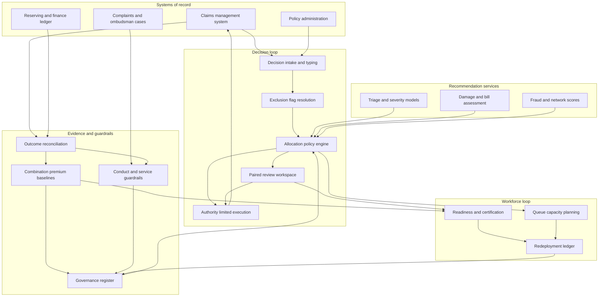

# Coadjust

**Source:** `ai-in-insurance/Accenture-AI-Future-Workforce-Insurance-Transcript/`
**Domain:** `ai-ins`
**One-liner:** A claims-workforce operating system that assigns every claim decision to an adjuster, a model, or a paired review based on measured *combined* accuracy, so an insurer books the human-machine accuracy premium instead of trading indemnity quality for headcount reduction.
**Wedge:** Personal-lines and health claims operations running 300–3,000 handlers, starting with the highest-volume decision types — motor damage assessment, glass and escape-of-water property claims, and medical bill review — where automation pressure is greatest and the displaced handler is redeployable to bodily-injury, complex-liability, and vulnerable-customer queues that are chronically short-staffed.
**Positioning:** Workforce infrastructure for regulated claims decisions. Claims automation vendors sell straight-through processing rate as the headline number; Coadjust treats the *pairing* as the unit of production, measures whether adjuster-plus-model beats either party alone on each decision type, and keeps the readiness and redeployment record that an insurer needs to defend both its indemnity spend and its restructuring.

## Market research synthesis

### Thesis from source

The source is the audio transcript of Accenture's 2018 Future Workforce Survey for insurance, and its argument turns on a single piece of evidence that most AI business cases quietly discard. A team of Harvard pathologists built an AI technique to identify breast cancer cells, scoring 92 percent accuracy. Human pathologists do better, at roughly 96 percent. But humans and AI combined identified 99.5 percent of cancerous biopsies. The document uses this to define what it calls applied intelligence — AI synthesised with human ingenuity to achieve more than either is capable of alone — and to argue that the value on the table is not only efficiency but innovation and growth. The commercial implication is precise and unusual: the machine is *worse* than the expert and the combination is better than both, which means the optimal design is neither full automation nor a human review rubber stamp, but a deliberately engineered pairing.

The survey then reports a readiness gap that makes that pairing hard to achieve. The vast majority of insurance executives believe AI will completely transform the industry, and more than two out of three expect it will produce a net *gain* in jobs in their own organisation. Employees are equally positive: over 60 percent said AI would expand their career prospects, create opportunities for their work, and improve their work-life balance. Yet the same executives say only one in four of their employees is ready to work with AI, and despite that, only 4 percent are planning to significantly increase their investment in reskilling over the next three years. The document calls this "the nub" and "a big problem": the workforce is named as critical to realising the value, and is simultaneously the line item nobody is funding.

The recommendations are organisational rather than technical. Insurers are told they need a broad strategy with long-term budgeting, a dedicated Chief AI Officer to oversee execution, a cross-enterprise engine that gives structure to AI and allows implementation at scale, and — crucially — a workforce that is skilled, deployed, and managed in very different ways so that new value can be created through human-machine collaboration. Without investment in this workforce of the future, the document warns, the effort to benefit from intelligent technologies "could be stillborn." Two constraints shape where that investment must go. Insurers are already on the back foot recruiting young people with the new in-demand skills, and they are reluctant to lay off the workers whose routine jobs are being taken over by AI. The transcript's conclusion is therefore that most of the effort and investment has to be directed internally, at transforming the existing workforce.

The context for urgency is the pace of adoption: IDC forecasts corporate investment in cognitive and AI systems increasing at an average 54 percent a year between 2015 and 2020, and Gartner predicts deep learning and machine learning reaching mainstream adoption within two to five years. Put together, the source describes a specific and buildable product. The measurable object is the pairing — which decisions the model should own, which the adjuster should own, and which should be co-decided, chosen by evidence of combined accuracy rather than by an automation-rate target. The organisational object is the internal talent pivot — who is ready for which paired role, what reskilling closes the gap, and where a handler released from a routine queue actually lands. An insurer that runs the first without the second gets headcount reduction and indemnity leakage; one that runs both gets the 99.5 percent.

### Buyer & economic model

- **Primary buyer:** Chief Claims Officer, jointly with the Chief AI Officer or transformation lead the source says the organisation needs; the HR director owns the redeployment and reskilling side of the same signature.
- **Users:** claims handlers and adjusters (continuous), team leaders and quality assurance reviewers (daily), claims technical and large-loss referral specialists (on referral), special investigations unit investigators (on referral), workforce planners and capacity managers (weekly), learning and capability leads (monthly), conduct and complaints managers (on exception), the Chief AI Officer and model governance committee (quarterly).
- **Budget owner / value metric:** the claims operating budget plus the reskilling and change budget the source shows is under-funded at 4 percent of firms increasing it. The value metric is indemnity accuracy per decision type — measured as leakage avoided and reserve variance — divided by fully-loaded handling cost, with paired decisions reported against the model-only and human-only baselines. The secondary metric is the internal fill rate for reskilled roles, because the alternative to redeployment is severance the source says insurers do not want to pay.
- **Competing status quo:** a straight-through processing initiative on a claims platform, sold on automation rate, with a random-sample quality assurance programme run in a spreadsheet, a separate learning management system nobody links to production outcomes, and workforce planning done in an annual capacity model. Nothing in that stack can answer whether the model plus the handler is more accurate than the handler, and nothing tracks whether the handler released from motor glass is now productive on bodily injury or simply idle.

### Domain constraints

- **Regulatory / trust / safety:** claims decisions are conduct-regulated. Statutory and contractual claims-handling timelines apply, declinature and partial-settlement decisions must be explicable to the policyholder, complaints escalate to an ombudsman who will ask who decided and on what basis, and fair-treatment and vulnerable-customer duties mean some claimants must reach a human regardless of the model's confidence. Automated decision-making that materially affects a policyholder carries a right to human review, so the allocation policy itself is a regulated artefact. Fraud referral must be evidenced rather than inferred, because a wrongful fraud flag is a conduct event, not a false positive.
- **Data sensitivity:** claims files carry health data, criminal-allegation data in fraud referrals, and household financial circumstances. Handler-level performance data is employment data subject to works-council and collective-agreement constraints in many European markets, and cannot be used for discipline or selection without disclosure. The product therefore has to separate decision-quality measurement (which is auditable and per-decision) from individual performance management (which is governed and consent-bound).
- **Change-management realities:** the source's own numbers set the pace — one in four employees ready, and reskilling budgets flat. Handlers who believe the system exists to make them redundant will game the confidence thresholds or defer to the model to avoid blame, and both behaviours destroy the combination premium. Union and works-council consultation is a gating step in most European claims operations, and the reluctance to lay off routine staff that the source names means the redeployment path must exist before the automation lands, not after.

## Business requirements

- BR-1: Every automated or paired claim decision type must have a published allocation basis showing measured accuracy for model-only, handler-only, and paired handling on the same decision population, and a decision type may only move to model-only where the model-only result is at least equal to the paired result.
- BR-2: The platform must report the combination premium — the accuracy gain from paired handling over the better of the two solo modes — per decision type per quarter, because that premium is the economic claim the programme is funded on and it decays as case mix shifts.
- BR-3: No decision that declines cover, reduces indemnity below the claimed amount, or refers a claimant for fraud investigation may be executed without a named human accountable for it, and that name must be retrievable for the full complaints and ombudsman window.
- BR-4: Claimants identified as vulnerable, and claims involving bodily injury or fatality, must be routed to human handling irrespective of model confidence, and any attempt to auto-allocate them must fail closed with a recorded reason.
- BR-5: Workforce readiness must be measured per paired role rather than in aggregate, so the organisation can act on the source's finding that only one in four employees is ready, and readiness must be evidenced by production decision quality rather than course completion alone.
- BR-6: Every handler whose queue volume is reduced by automation must have a named destination role, a reskilling path with a funded start date, and a tracked outcome, so that the reluctance to make routine staff redundant translates into redeployment rather than idle capacity.
- BR-7: The reskilling and redeployment investment must be reported against the capacity it releases and the queues it fills, so that the budget the source shows is under-funded can be defended with a return figure rather than a conviction.
- BR-8: Claims-handling service timelines must be met or improved for every decision type after an allocation change, and a deterioration in cycle time or complaint rate must automatically suspend further automation of that decision type.
- BR-9: The system must detect and report automation bias — handlers accepting model recommendations at rates inconsistent with the model's demonstrated accuracy — and treat sustained over-deference as a defect in the pairing design rather than a training issue for the individual.
- BR-10: Model recommendations that a handler overrides must be captured with the override reason and the eventual settled outcome, and that record must be the primary input to retraining, because the override population is where the combination premium is generated.
- BR-11: Allocation policy, readiness thresholds, and vulnerability routing rules must be versioned, approved by a named governance body, and reproducible for any historic decision, so that the insurer can show a regulator which policy was in force on the day a specific claim was handled.
- BR-12: Handler-level decision data must be usable for pairing design and capability planning without being available for individual disciplinary action, and this separation must be enforced by access policy that is itself auditable.

## User stories

Canonical user stories live in sibling [USER_STORIES.md](USER_STORIES.md).

## System design

### Overview

Coadjust sits between the claims management system and the people who work in it. Every claim event that requires a decision — a first notification of loss needing triage, a damage estimate needing approval, a medical bill needing adjudication, an indemnity figure needing sign-off — is intercepted as a *decision request*. The allocation engine resolves that request against the active allocation policy for its decision type, the claim's own exclusion flags (vulnerability, bodily injury, litigation, catastrophe event), and current queue capacity, and returns one of three modes: model-only execution, handler-only, or paired review in which the model's recommendation and rationale are presented to a named handler who decides. Outcomes are then reconciled against ground truth as it becomes available — the settled amount, the closed reserve, the complaint, the recovery, the fraud finding — which produces the three accuracy series the product exists to compare. Those series drive both the allocation policy and the second half of the system: a readiness and redeployment ledger that tracks which handlers are qualified for which paired roles, which capacity each automation change releases, and where that capacity actually landed.

### Actors & boundaries

- **Actors:** claims handler, team leader, technical and large-loss referral specialist, special investigations unit investigator, quality and conduct manager, workforce planner, capability lead, Chief AI Officer and model governance committee, data protection officer, and the claimant whose claim is being decided.
- **Trust boundary:** the claims management system remains the system of record for the claim and the payment; Coadjust holds the decision request, the allocation, the recommendation, the human judgement, and the reconciliation. Models are consumed as scored recommendations and never granted authority to instruct payment directly — an automated mode still executes through the claims system under a policy-scoped authority limit. Handler identity crosses into the platform for accountability; handler performance never crosses back out into HR systems without an explicit governed extract.
- **Human-in-the-loop points:** every declinature, indemnity reduction, and fraud referral; every claim carrying a vulnerability or bodily-injury flag; every override; every allocation policy change; every readiness certification; every redeployment assignment.

### Core capabilities

1. **Decision intake and typing** — normalises claim events into decision requests, assigns a decision type, and attaches exclusion flags for vulnerability, injury, litigation, and catastrophe accumulation.
2. **Allocation policy engine** — resolves mode (model, human, paired) from versioned policy, evidence thresholds, exclusion flags, and live capacity, and fails closed when a rule cannot be satisfied.
3. **Paired review workspace** — presents recommendation, confidence, drivers, and the comparable historic outcomes to the accountable handler, and captures agreement, override, and override reason.
4. **Outcome reconciliation** — binds each decision to its realised outcome (settlement, reserve movement, recovery, complaint, fraud finding) to produce accuracy series per mode.
5. **Combination premium analytics** — maintains the model-only, human-only, and paired accuracy comparison per decision type, and the deference and override behaviour that explains it.
6. **Readiness and certification** — measures per-role readiness from production decision quality and completed capability paths, and certifies handlers into paired roles.
7. **Redeployment ledger** — records capacity released by each allocation change, the destination queue or role, the reskilling path, funded start date, and realised outcome.
8. **Conduct and service guardrails** — monitors cycle time, complaint rate, and reversal rate per decision type and suspends automation changes that breach threshold.
9. **Governance register** — the register of decision types, allocation modes, evidence, approvals, and policy versions the Chief AI Officer is accountable for.
10. **Workforce and capacity planning** — projects handler demand per queue under proposed allocation changes so that automation and redeployment are planned as one decision.

### Conceptual data

- **Primary entities:** DecisionType, DecisionRequest, AllocationPolicy, Recommendation, HumanJudgement, Outcome, CombinationBaseline, Handler, RoleProfile, ReadinessAssessment, CapabilityPath, RedeploymentAssignment, QueueCapacityPlan, ConductGuardrail, GovernanceApproval, ExclusionFlag.
- **Critical events:** decision request raised, mode allocated, recommendation issued, human judgement recorded, override captured with reason, decision executed in the claims system, outcome reconciled, guardrail breached, automation suspended, allocation policy version approved, handler certified into role, capacity released, redeployment assigned and completed.
- **Retention / audit needs:** decision requests, allocations, recommendations, human judgements, and the policy version in force must be retained for the longest of the complaints and ombudsman window, the liability limitation period, and the reserving development tail for the class — for bodily injury that is many years. Accuracy baselines retain the population definition and evidence so a historic allocation can be justified on the evidence available at the time. Handler-level records carry a shorter retention and a purpose-limited access policy; readiness and redeployment records are retained under employment-record rules with works-council-agreed access.

### Integrations (conceptual)

- **Systems of record:** claims management and payments platform, policy administration for cover and limits, reserving and finance ledger for indemnity and reserve movements, complaints and ombudsman case management, HR core for role and employment data, learning management for capability paths.
- **Upstream signals:** claim scoring and triage models, damage estimation and image assessment services, medical bill adjudication rules, fraud and network-analytics scores, vulnerability indicators captured at first notification, catastrophe event tagging, workforce rosters and shift capacity.
- **Downstream actions:** allocation instructions and work assignment into the claims queue, authority-limited execution of automated decisions, referral creation for technical, large-loss, and fraud investigation, suspension notices on automated decision types, redeployment and training enrolment, and quarterly evidence packs for the model governance committee and the regulator.

### High-level architecture

Two loops share one register. The decision loop runs at claim speed and must fail closed; the workforce loop runs at quarterly planning speed and consumes the decision loop's evidence. Separating them keeps a capacity shortage from silently relaxing a conduct guardrail.

### Success metrics

- **Leading:** share of decision types with a complete three-mode accuracy baseline; override rate and override-upheld rate in paired mode; deference divergence between handler acceptance rate and demonstrated model accuracy; proportion of released capacity with a named destination role and funded start date; readiness rate per paired role against the one-in-four baseline the source reports; median time from guardrail breach to automation suspension.
- **Lagging:** indemnity leakage and reserve variance per decision type versus the pre-pairing baseline; combination premium sustained over four quarters; claims cycle time and complaint rate by decision type; overturn rate at ombudsman for automated and paired decisions; internal fill rate for reskilled roles versus external hire and severance cost; reskilling spend as a share of the claims operating budget compared with the 4 percent of insurers the source found were increasing it.

## OpenAPI skeleton

Canonical HTTP surface lives in sibling [openapi.yaml](openapi.yaml). Summary:

- **Base path:** `/v1/...`
- **Auth:** `X-API-Key` for claims-platform and model-service integration; Bearer JWT for handlers, team leaders, and governance users.
- **Resource groups:** Decisions, Allocation, Pairing, Evidence, Workforce, Governance.
