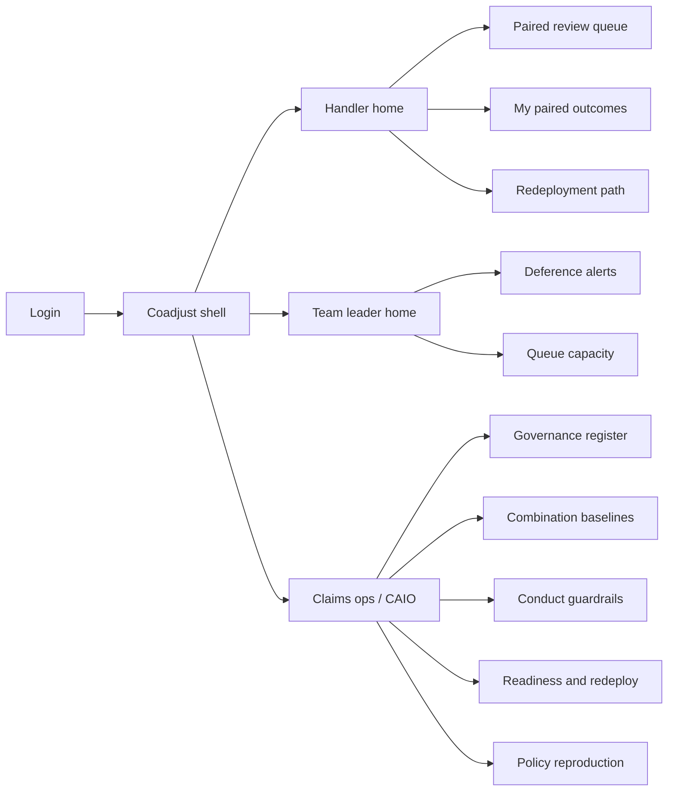
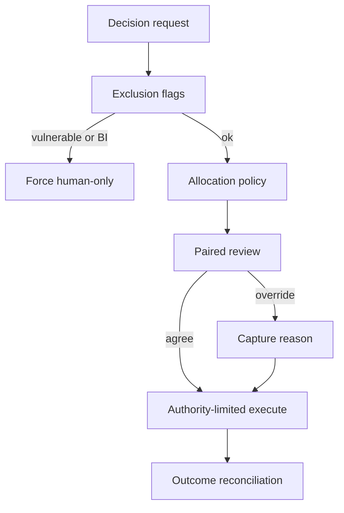
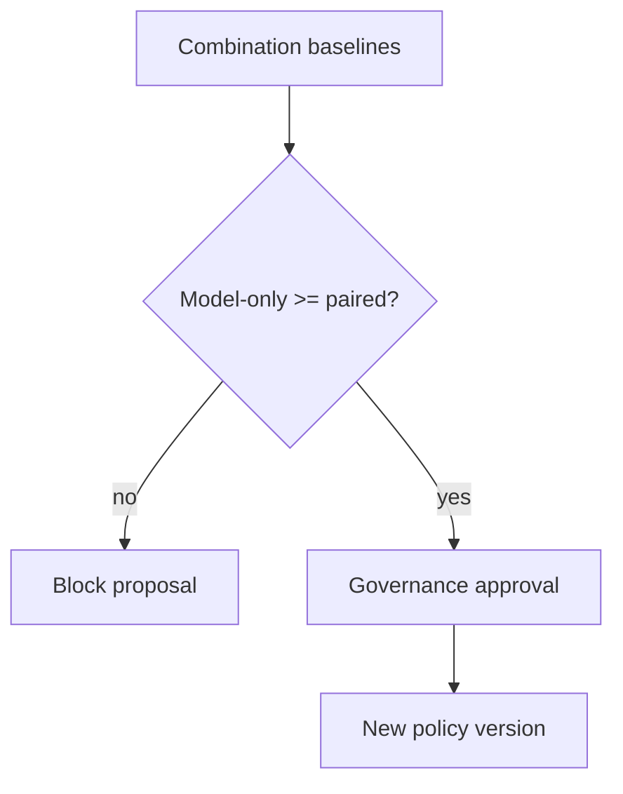

# Coadjust — Web app

**Product:** [PRODUCT.md](./PRODUCT.md)
**Primary surface:** Claims pairing console (handler workspace + ops/governance shell)
**Secondary surfaces:** Redeployment ledger (workforce planners); policy reproduction export (read-only for conduct/ombudsman packs)
**Design thesis:** Coadjust is a claims operating theatre for *paired* decisions — not an STP scoreboard. The visual metaphor is a three-lane accuracy strip (model-only / human-only / paired) beside a named accountable human, on a cool clinical steel-and-teal ground: the combination premium is the hero number, automation rate is secondary. Every declinature, indemnity cut, and fraud referral carries a human nameplate that cannot be dismissed; vulnerable and bodily-injury routes fail closed with a structural lock, not a soft warning.

## UX research synthesis

### Category peers (best-in-class)

- **Guidewire ClaimCenter:** Dense claim-file workspace, authority limits, and work-assignment queues that keep the claim as system of record. Steal: embed Coadjust pairing *inside* the claim context with clear authority chrome; reject ClaimCenter’s lack of three-mode accuracy baselines as a first-class object.
- **Snapsheet (Virtual Claims / Estimate):** Photo-led damage assessment with adjuster review and confidence cues. Steal: recommendation + drivers + agree/override in one interaction; reject “automation rate” as the primary home KPI.
- **Shift Technology (claims decisioning):** Explainable triage/fraud scores with referral workflows. Steal: reason-coded override capture and SIU referral evidence; reject black-box confidence that cannot be reconciled to settled outcomes.
- **Workday Talent Marketplace (redeployment patterns):** Role destinations, skill gaps, and funded pathways as operational objects. Steal: named destination role + start date as a blocking record before capacity is released; reject LMS course-completion as readiness proof.

### Patterns to adopt / reject

- **Adopt:** Three-mode accuracy baselines per decision type; combination premium as the funded KPI; named human on every material adverse decision; fail-closed exclusion banners for vulnerability/BI; deference divergence alerts for team leaders; redeployment ledger tied to each automation change; versioned allocation policy with reproduction lookup.
- **Reject:** STP % as the hero metric; anonymous “AI decided”; editable settled outcomes; handler performance dashboards that double as disciplinary tools; purple “AI insights” cards; chatbot as the allocation designer.

### Trust, density, and workflow constraints from PRODUCT.md

Claims decisions are conduct-regulated (BR-3, BR-4, BR-11): ombudsman windows demand who decided and which policy version applied. Handler-level data is employment-sensitive (BR-12) — pairing design may use it; discipline may not. Automation that worsens cycle time or complaints must suspend itself (BR-8). Redeployment must exist *before* volume drops (BR-6, BR-7). Density is finance/indemnity-grade on evidence screens, conversational on the paired review pane so handlers do not defer blindly (BR-9, BR-10).

## Information architecture

### Nav model

### Roles → default home

| Role | Default home | Why |
|------|--------------|-----|
| Claims handler / adjuster | Paired review queue | Continuous production decisions |
| Team leader | Deference + capacity | Catch over-deference and queue ageing (BR-8, BR-9) |
| Quality / conduct manager | Combination baselines + guardrails | Challenge automation that costs accuracy (BR-1, BR-2) |
| Workforce planner / capability | Readiness and redeploy | Capacity released → destination (BR-5–7) |
| Chief AI Officer / governance | Governance register | Central allocation evidence (BR-11) |
| Data protection / works council liaison | Access policy + governed extracts | Enforce BR-12 separation |

### Cross-links to OpenAPI resources

| Nav area | OpenAPI tags / resources |
|----------|---------------------------|
| Decision types, requests | Decisions |
| Mode allocation, policies | Allocation |
| Recommendation, judgement | Pairing |
| Outcomes, baselines, deference, suspensions | Evidence |
| Readiness, redeployments, capacity | Workforce |
| Register, policy reproduction | Governance |

## Screen inventory

### Handler home

- **Purpose:** Show today’s paired queue depth, service timers, and any personal redeployment status without HR theatre.
- **Entry:** Handler login default.
- **Layout regions:** Brand + claim-system deep-link chrome; queue summary (paired / human-only assigned); service timeline strip; optional redeployment card (destination role, gap, start date) when capacity is being released.
- **Primary actions:** Open next paired review; open my outcomes; view redeployment path.
- **Empty / loading / error:** Empty queue = “no paired work — check human-only assignments”; loading = skeleton list; error = retry with decision request id.
- **BR / story ties:** Handler stories; BR-6 when automation reduces volume.

### Paired review workspace

- **Purpose:** One decision: agree or override with reason, seeing recommendation, confidence, drivers, and comparable historic outcomes.
- **Entry:** Queue item or claim-system deep link.
- **Layout regions:** Claim context header (type, exclusions, authority); recommendation panel (score, drivers); comparable outcomes; agree / override with reason codes; accountable-human nameplate (self); fail-closed lock if vulnerability/BI.
- **Primary actions:** Agree and execute; override with reason; escalate to technical/SIU; refuse auto-path when exclusion present.
- **Empty / loading / error:** Model unavailable → fail to human-only with recorded reason; exclusion attempt → structural block, not dismissible toast.
- **BR / story ties:** BR-3, BR-4, BR-10; handler override stories.

### My paired outcomes

- **Purpose:** Calibrate scepticism: paired decisions vs settled outcomes, without ranking peers.
- **Entry:** Handler nav.
- **Layout regions:** Personal accuracy vs settled; override-upheld rate; no team league tables.
- **Primary actions:** Filter by decision type; open historic judgement.
- **Empty / loading / error:** Insufficient settled outcomes = “awaiting ground truth.”
- **BR / story ties:** Handler calibration story; BR-12 (no peer discipline view).

### Team leader home

- **Purpose:** Explain operating model by decision type and act on deference / capacity.
- **Entry:** Leader login.
- **Layout regions:** Decision-type mode map (model / human / paired + why); deference divergence alerts; queue ageing vs service targets.
- **Primary actions:** Open handler deference detail (purpose-limited); reallocate capacity; open guardrail status.
- **Empty / loading / error:** No alerts = healthy pairing message with last baseline date.
- **BR / story ties:** BR-8, BR-9; team leader stories.

### Combination baselines

- **Purpose:** Fund the programme: model-only vs human-only vs paired accuracy and the combination premium per decision type.
- **Entry:** Ops / quality home; CAIO register drill-in.
- **Layout regions:** Decision-type table; three-lane accuracy chart; premium trend; population definition and evidence pack link; “may move to model-only only if ≥ paired” gate indicator.
- **Primary actions:** Challenge automation proposal; export quarterly pack; open guardrail linkage.
- **Empty / loading / error:** Incomplete baseline = cannot approve mode change (BR-1).
- **BR / story ties:** BR-1, BR-2; quality manager stories.

### Conduct guardrails and suspensions

- **Purpose:** Auto-suspend automation when cycle time or complaints deteriorate.
- **Entry:** Ops nav; alert from baselines.
- **Layout regions:** Threshold table; breach timeline; suspension state per decision type; resume requires governance approval.
- **Primary actions:** Acknowledge breach; open complaints slice; request resume via governance.
- **Empty / loading / error:** Active suspension = coral blocking banner on related allocation screens.
- **BR / story ties:** BR-8.

### Governance register

- **Purpose:** Single register of decision types, modes, evidence, approvals, and policy versions.
- **Entry:** CAIO / governance default.
- **Layout regions:** Register table; policy version drawer; approval trail; exclusion rule summary.
- **Primary actions:** Propose mode change; approve/reject; open reproduction.
- **Empty / loading / error:** Pending approvals queue empty = all current policies signed.
- **BR / story ties:** BR-11; CAIO stories.

### Allocation policy editor

- **Purpose:** Versioned rules for mode resolution with evidence thresholds and exclusions.
- **Entry:** From register → edit / new version.
- **Layout regions:** Rule builder (thresholds, capacity checks); exclusion flags; evidence attachment; approval request.
- **Primary actions:** Save draft; submit for approval; compare to prior version.
- **Empty / loading / error:** Validation blocks model-only when baseline incomplete or paired still better.
- **BR / story ties:** BR-1, BR-4, BR-11.

### Policy reproduction

- **Purpose:** For any historic claim/decision, show which policy version and accountable human applied.
- **Entry:** Conduct / ombudsman pack; governance nav.
- **Layout regions:** Lookup by claim or decision request id; immutable snapshot; export pack.
- **Primary actions:** Reproduce; export for regulator/ombudsman.
- **Empty / loading / error:** Not found = clear retention boundary message.
- **BR / story ties:** BR-3, BR-11; conduct manager stories.

### Readiness and certification

- **Purpose:** Per-role readiness from production quality + capability paths — not course ticks alone.
- **Entry:** Workforce nav.
- **Layout regions:** Role profile list; readiness vs one-in-four baseline; certification status; purpose-limited handler aggregates.
- **Primary actions:** Certify into paired role; open capability path; export works-council-safe summary.
- **Empty / loading / error:** Unready role = block pairing assignment.
- **BR / story ties:** BR-5, BR-12.

### Redeployment ledger

- **Purpose:** Every automation-released handler has destination, funded start, tracked outcome.
- **Entry:** Workforce planner home; triggered when allocation change releases capacity.
- **Layout regions:** Capacity released by change; destination queue/role; reskilling path; cost vs fill ROI; completion status.
- **Primary actions:** Assign destination; fund start date; mark completed/failed.
- **Empty / loading / error:** Capacity without destination = blocking gate before automation go-live.
- **BR / story ties:** BR-6, BR-7.

### Queue capacity planning

- **Purpose:** Project demand under proposed allocation changes so automation and redeployment are one decision.
- **Entry:** Leader / planner nav.
- **Layout regions:** Queue forecast; proposed mode mix; fill gaps; service risk flags.
- **Primary actions:** Simulate change; push to redeployment ledger; open guardrails.
- **Empty / loading / error:** Missing roster feed = planning degraded banner.
- **BR / story ties:** BR-6–8; capacity stories.

## Key flows

1. **Paired decision** — intake → allocate paired → review recommendation → agree/override with reason → execute in claims system → later reconcile outcome; failure: model down → human-only; exclusion → fail closed.

2. **Approve model-only move** — complete three-mode baseline → prove model-only ≥ paired → governance approval → version publish; failure: incomplete baseline or premium loss blocks submit.

3. **Guardrail suspension** — cycle time/complaint breach → auto-suspend automation on decision type → notify ops → resume only via governance.

4. **Redeploy before automate** — capacity plan shows release → named destination + funded start required → then allocation change may go live (BR-6).

5. **Ombudsman reproduction** — lookup decision → show accountable human + policy version → export evidence pack (BR-3, BR-11).

## Design system

### Tokens (CSS variables)

- `--color-ink: #E6EDF2` — primary text on dark clinical ground
- `--color-steel-950: #0A1218` — app ground
- `--color-steel-900: #121A22` — panels
- `--color-steel-700: #2C3A48` — dividers
- `--color-teal: #2BB8A3` — paired / combination premium confirmation
- `--color-teal-dim: #1A6B5E` — teal on dark
- `--color-slate-blue: #6B8CA8` — secondary labels / human-only lane
- `--color-amber: #D4A017` — deference warning / provisional
- `--color-coral: #D94B4B` — suspension / fail-closed / fraud referral
- `--color-brand: #8EC9BC` — Coadjust wordmark (quiet clinical teal)
- `--font-display: "Source Serif 4", serif` — screen titles and premium numerals (not Inter)
- `--font-body: "IBM Plex Sans", sans-serif` — UI chrome
- `--font-mono: "IBM Plex Mono", monospace` — decision ids, policy versions
- `--space-1`…`--space-8`: 4px scale
- `--radius-sm: 4px`; `--radius-md: 6px` — sharp claims-ops, not soft consumer
- `--motion-pair: 200ms ease-out` — recommendation panel settle
- `--motion-lock: 160ms ease-in` — fail-closed banner snap
- `--motion-suspend: 280ms ease-in-out` — coral pulse on automation suspension
- Atmosphere: cool steel gradient with faint ECG-like horizontal rhythm (pairing heartbeat); no stock “happy call centre” photography in console.

### Typography & brand

- Display serif for combination premium and register titles; body sans for queues; mono for policy version and decision request ids.
- Wordmark left in shell on every decision-bearing screen; never replace with generic “Dashboard.”
- Login shell: brand hero (“Pair for accuracy”); one supporting line on the Harvard-pathology combination idea; one CTA — no STP stat strip.

### Do / don’t

- **Do:** Show three lanes of accuracy; name the accountable human; lock vulnerable/BI routes; gate automation on redeployment records; segregate handler data for pairing vs discipline.
- **Don’t:** Hero STP %; anonymous AI decisions; peer performance leagues; purple AI glow; card grids of vanity KPIs; emoji status.

### Accessibility & domain trust cues

- AA+ contrast on teal/amber/coral vs steel; fail-closed states use lock icon + text, not colour alone.
- Live regions announce suspensions and deference alerts.
- Focus order: exclusions → recommendation → judgement → execute.
- Reproduction exports are machine-readable for auditors.

## Component patterns

- **ThreeLaneAccuracy** — model / human / paired bars with combination premium delta.
- **AccountableNameplate** — immutable human name on adverse decisions.
- **FailClosedLock** — structural block for vulnerability/BI/automation attempts.
- **OverrideReasonSheet** — one-step reason capture feeding retraining.
- **DeferenceAlert** — acceptance rate vs demonstrated model accuracy.
- **RedeployGate** — blocks go-live until destination + funded start exist.
- **PolicyVersionChip** — version id with reproduction deep link.
- **SuspensionBanner** — coral automation halt with governance path.

## Out of scope for v1 web

- Native mobile adjuster apps; replacement of the claims management system of record; end-policyholder self-serve claims UX; headset/AR inspection clients; HR performance-management suites; full LMS authoring; model training notebooks for data scientists.
